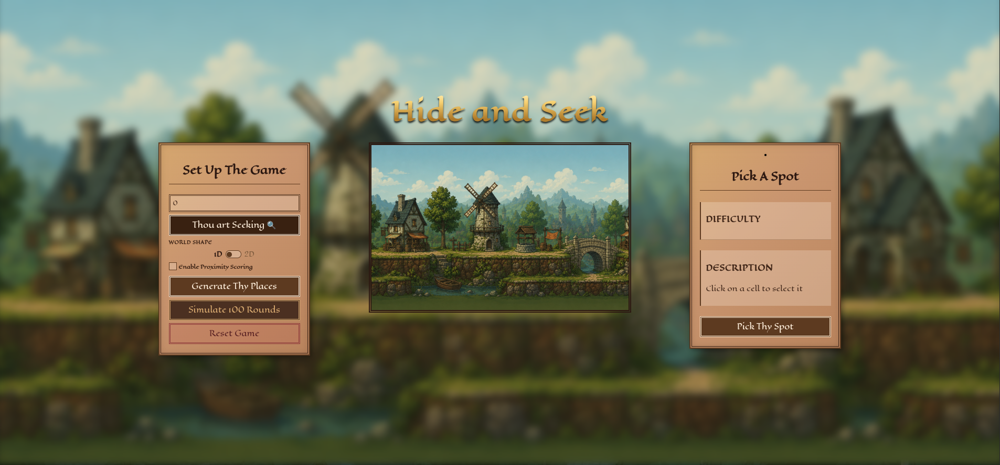
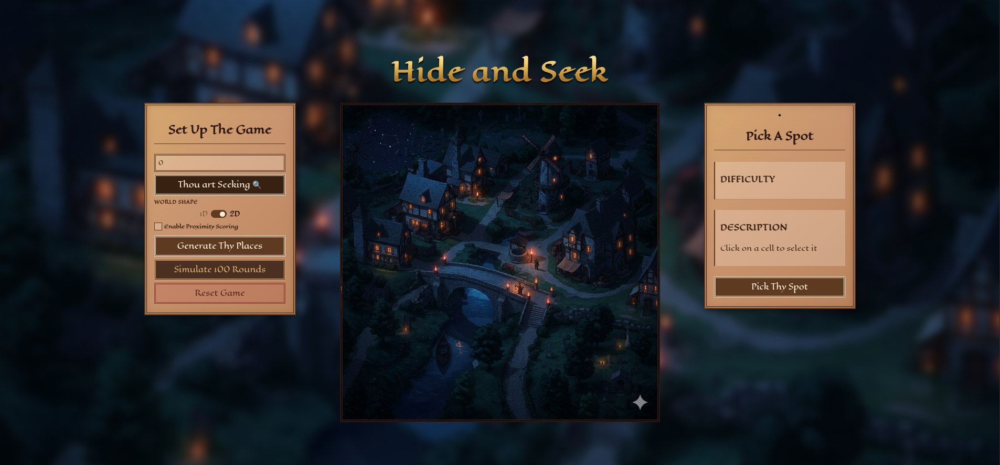

# Hide and Seek

A two-player zero-sum game simulation built on **Game Theory** and **Linear Programming**. One player hides, the other seeks — the computer computes optimal mixed strategies for both sides using a custom two-phase Simplex solver, then plays the game round by round.

---

## Interface

**1D Linear Map Mode**



**2D Grid Map Mode**



---

## Overview

The game models a classic hide-and-seek scenario as a zero-sum matrix game. Given a set of hiding spots with associated difficulty ratings, the backend:

1. Constructs a **payoff matrix** encoding the strategic interaction between hider and seeker.
2. Solves for the **Nash equilibrium** (optimal mixed strategies) using a two-phase Simplex solver over a Linear Program derived from the matrix game.
3. Plays individual rounds or runs full simulations, tracking scores across multiple rounds.

The frontend provides an interactive Angular interface where the user picks a role (hider or seeker), selects a map mode, chooses a spot, and sees the result alongside the full payoff matrix and probability distributions.

---

## Tech Stack

| Layer    | Technology                          |
|----------|-------------------------------------|
| Backend  | Java 17, Spring Boot 3.2.5, Maven   |
| Solver   | Custom two-phase Simplex (Java)     |
| Frontend | Angular 17+, TypeScript             |
| Comms    | RESTful HTTP (JSON)                 |

---

## Project Structure

```
Hide-and-Seek/
├── backend/
│   └── hide-and-seek/
│       └── src/main/java/hns/
│           ├── controller/
│           │   └── GameController.java       # REST endpoints
│           ├── model/
│           │   ├── GameSettings.java
│           │   ├── GameResult.java
│           │   ├── SimulationSettings.java
│           │   ├── SimulationResults.java
│           │   ├── HidingSpot.java
│           │   ├── PlayerRole.java
│           │   └── Difficulty.java
│           ├── service/
│           │   ├── GameService.java          # Round logic and simulation
│           │   ├── LPSolverService.java      # LP formulation from payoff matrix
│           │   └── PayoffMatrixService.java  # Matrix construction strategies
│           └── solver/
│               ├── SimplexSolver.java        # Two-phase Simplex implementation
│               └── SolverService.java
└── frontend/
    └── hide_and_seek/
        └── src/app/
            ├── components/
            │   ├── spot-setup/               # Role and map mode selection
            │   ├── map/                      # 2D interactive map
            │   ├── linear-map/               # 1D linear spot layout
            │   ├── spot-data/                # Spot detail panel
            │   └── results/                  # Payoff matrix, probabilities, scores
            ├── services/
            │   ├── solver.service.ts         # HTTP calls to the backend
            │   ├── solver-state.service.ts   # Reactive game state
            │   └── game-data.service.ts      # Shared spot and mode data
            └── models/
```

---

## How It Works

### Payoff Matrix Construction

Three strategies are supported depending on the map mode:

- **Standard 1D** — payoff based on raw spot difficulty values.
- **1D Proximity-aware** — payoff accounts for adjacency between spots on the linear map.
- **2D Manhattan Proximity-aware** — payoff uses Manhattan distance on the grid map.

### Linear Program and Simplex Solver

The payoff matrix is converted to a standard LP. The solver finds the optimal mixed strategy (probability distribution over spots) for both hider and seeker. The value of the game (expected payoff at equilibrium) is also returned.

### Gameplay

- **Play mode** — the user picks a spot; the computer draws from its optimal mixed strategy; the result (found / not found) is resolved and scored.
- **Simulation mode** — a configurable number of rounds are played automatically, and aggregate statistics are returned.

---

## API Reference

Base URL: `http://localhost:8080/api/game`

| Method | Endpoint    | Description                              |
|--------|-------------|------------------------------------------|
| POST   | `/play`     | Play a single round with given settings  |
| POST   | `/simulate` | Run a multi-round simulation             |

### POST `/play` — Request Body

```json
{
  "spots": [...],
  "playerRole": "HIDER",
  "mapMode": "1D",
  "pickedSpot": 2
}
```

### POST `/simulate` — Request Body

```json
{
  "spots": [...],
  "mapMode": "2D",
  "rounds": 100
}
```

---

## Running Locally

### Prerequisites

- Java 17+
- Maven 3.8+
- Node.js 18+ and npm

### Backend

```bash
cd backend/hide-and-seek
./mvnw spring-boot:run
```

The server starts on `http://localhost:8080`.

### Frontend

```bash
cd frontend/hide_and_seek
npm install
npm run start
```

The app is served on `http://localhost:4200`.

---

## Map Modes

| Mode | Description                                                                 |
|------|-----------------------------------------------------------------------------|
| 1D   | Spots are arranged on a linear path. Proximity affects the payoff matrix.   |
| 2D   | Spots are placed on a 2D grid. Manhattan distance shapes the payoff matrix. |

---

